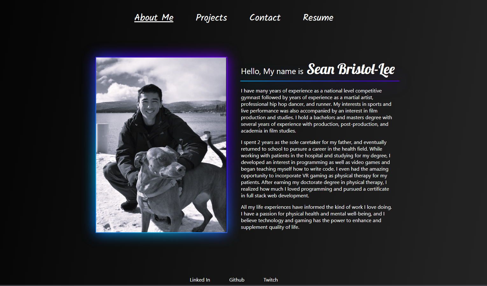

# my-portfolio-react

 ## Description
 The purpose of this project was to build a portfolio page showcasing my work, work experience, educational background, and some of my general life experiences while using the React library to create this virtual document. Part of the motivation to create this portfilio is to allow future employeers to get to know me better, and to also demonstrate my ability to create a webpage portfolio using React, JavaScript, html, and CSS. I truly enjoyed the process of creating my own html document and adding my own css code to create something that represents me. I know that employers do want to see work from employee candidates and this webpage solves that problem by showcasing to other what I can do with my skill set. I learned a lot about how to create a wepage using React, but something I really enjoyed learning from this process is how to problem solve and use develolment tools to make the process of building and debuging easier.      

 ## Table of Contents

- [Installation](#installation)
- [Usage](#usage)
- [License](#license)
- [How to contribute](#how-to-contribute)
- [Tests](#tests)
- [Questions](#questions)

## Installation
No installation is required to view the webpage. Here is a link to the deployed website: https://seanbl.github.io/

## Usage
The following image shows the web application's appearance and functionality:

The Portifolio includes a header with a "about me", "Projects", "Contact", and "Resume" links. The links will link to the appropriate pages in the portfolio. The project page displays 6 applications that I have worked on individually or in groups. Each image has two links. The "github" link will take the user to the github repo for that project. The "demo" link will take the user to the deployed site where the user can test out the application. At the very bottom is the footer with a list of links to contact with me through Linked In, Github, or Twitch.  

**Note**: This lay out is designed to be viewed in either desktop viewing, ipads, or mobile phones. The webpage content does adjust to screen size.

## License
MIT License

A short and simple permissive license with conditions only requiring preservation of copyright and license notices. Licensed works, modifications, and larger works may be distributed under different terms and without source code. Refer to link for more details: https://choosealicense.com/licenses/mit/

## How to Contribute
Feel free to contribute to my project on GitHub. A link to the repository is above and a link to my GitHub page is provided in the Questions section.

## Tests
N/A  

## Questions
Feel free to view and contribute to my work on GitHub.
https://github.com/SeanBL

For additional questions, can also reach me through my email address here:
seanbristol81@gmail.com